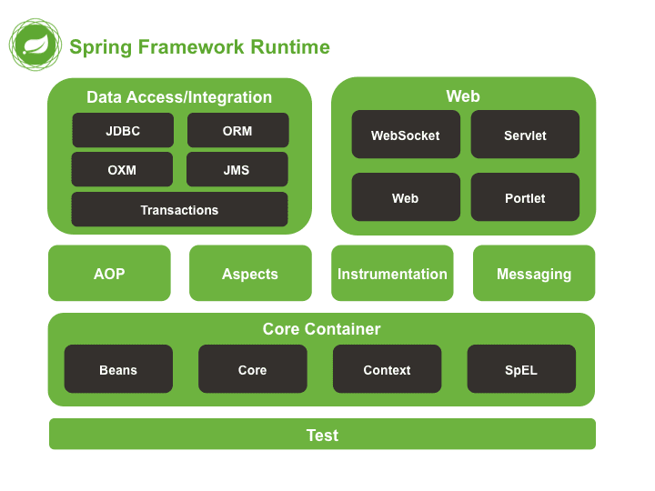
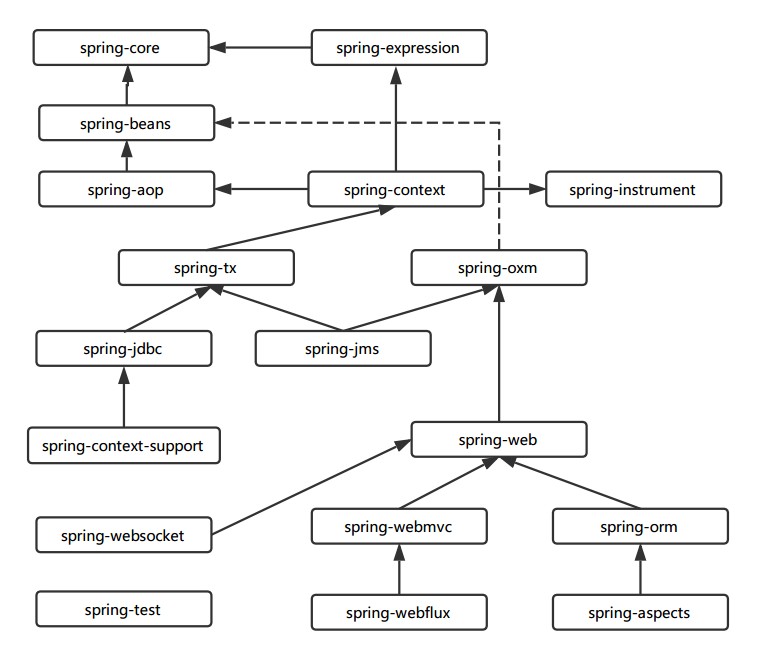
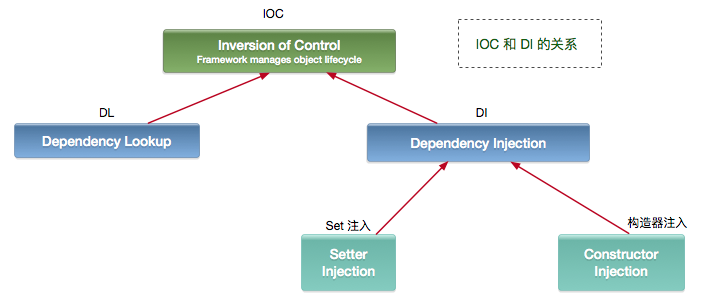

= the framework of the mainstream
:doctype: book
:toc: left
:toc-title: 目录
:toclevels: 3
:title-separator: -
:sectnums:
:allow-uri-read: ''
:include-path:

== Knowledge Point

=== Spring

==== Spring 框架组成

Spring 总共大约有 20 个模块， 由 1300 多个不同的文件构成。 而这些组件被分别整合在核心容器（Core Container） 、 AOP（Aspect Oriented Programming） 和设备支持（Instrmentation） 、数据访问及集成（Data Access/Integeration） 、 Web、 报文发送（Messaging） 、 Test， 6 个模块集合中

下图是 Spring（5.X） 的体系结构图 

===== 核心容器

由 spring-beans、spring-core、spring-context 和 spring-expression（Spring Expression Language, SpEL） 4 个模块组成：

. spring-beans 和 spring-core 模块是 Spring 框架的核心模块， 包含了控制反转（Inversion of Control, IOC） 和依赖注入（Dependency Injection, DI） 。 BeanFactory 接口是 Spring 框架中的核心接口， 它是工厂模式的具体实现。 BeanFactory 使用控制反转对应用程序的配置和依赖性规范与实际的应用程序代码进行了分离。 但 BeanFactory 容器实例化后并不会自动实例化 Bean， 只有当 Bean 被使用时 BeanFactory 容器才会对该 Bean 进行实例化与依赖关系的装配。

. spring-context 模块构架于核心模块之上， 他扩展了 BeanFactory， 为它添加了 Bean 生命周期控制、 框架事件体系以及资源加载透明化等功能·。 此外该模块还提供了许多企业级支持， 如邮件访问、远程访问、 任务调度等， ApplicationContext 是该模块的核心接口，它是 BeanFactory 的超类， 与 BeanFactory 不同， ApplicationContext 容器实例化后会自动对所有的单实例 Bean 进行实例化与依赖关系的装配， 使之处于待用状态。

. spring-expression 模块是统一表达式语言（EL） 的扩展模块， 可以查询、 管理运行中的对象，同时也方便的可以调用对象方法、 操作数组、 集合等。 它的语法类似于传统 EL， 但提供了额外的功能，最出色的要数函数调用和简单字符串的模板函数。 这种语言的特性是基于 Spring 产品的需求而设计，他可以非常方便地同 Spring IOC 进行交互。

===== AOP 和设备支持

由 spring-aop、 spring-aspects 和 spring-instrument3 个模块组成

. spring-aop 是 Spring 的另一个核心模块， 是 AOP 主要的实现模块。 作为继 OOP 后， 对程序员影响最大的编程思想之一， AOP 极大地开拓了人们对于编程的思路。 在 Spring 中， 他是以 JVM 的动态代理技术为基础， 然后设计出了一系列的 AOP 横切实现， 比如前置通知、 返回通知、 异常通知等， 同时，Pointcut 接口来匹配切入点， 可以使用现有的切入点来设计横切面， 也可以扩展相关方法根据需求进行切入。

. spring-aspects 模块集成自 AspectJ 框架， 主要是为 Spring AOP 提供多种 AOP 实现方法。

. spring-instrument 模块是基于 JAVA SE 中的``java.lang.instrument''进行设计的， 应该算是 AOP 的一个支援模块， 主要作用是在 JVM 启用时， 生成一个代理类， 程序员通过代理类在运行时修改类的字节， 从而改变一个类的功能， 实现 AOP 的功能。 在分类里， 我把他分在了 AOP 模块下， 在 Spring 官方文档里对这个地方也有点含糊不清， 这里是纯个人观点。

===== 数据访问及集成

由 spring-jdbc、 spring-tx、 spring-orm、 spring-jms 和 spring-oxm 5 个模块组成:

. spring-jdbc 模块是 Spring 提供的 JDBC 抽象框架的主要实现模块， 用于简化 Spring JDBC。主要是提供 JDBC 模板方式、 关系数据库对象化方式、 SimpleJdbc 方式、 事务管理来简化 JDBC 编程， 主要实现类是 JdbcTemplate、 SimpleJdbcTemplate 以及 NamedParameterJdbcTemplate。

. spring-tx 模块是 Spring JDBC 事务控制实现模块。 使用 Spring 框架， 它对事务做了很好的封装，通过它的 AOP 配置， 可以灵活的配置在任何一层； 但是在很多的需求和应用， 直接使用 JDBC 事务控制还是有其优势的。 其实， 事务是以业务逻辑为基础的； 一个完整的业务应该对应业务层里的一个方法；如果业务操作失败， 则整个事务回滚； 所以， 事务控制是绝对应该放在业务层的； 但是， 持久层的设计则应该遵循一个很重要的原则： 保证操作的原子性， 即持久层里的每个方法都应该是不可以分割的。 所以， 在使用 Spring JDBC 事务控制时， 应该注意其特殊性。

. spring-orm 模块是 ORM 框架支持模块， 主要集成 Hibernate, Java Persistence API (JPA) 和 Java Data Objects (JDO) 用于资源管理、 数据访问对象(DAO)的实现和事务策略。

. spring-jms 模块（Java Messaging Service） 能够发送和接受信息， 自 Spring Framework 4.1 以后， 他还提供了对 spring-messaging 模块的支撑。

. spring-oxm 模块主要提供一个抽象层以支撑 OXM（OXM 是 Object-to-XML-Mapping 的缩写， 它是一个 O/M-mapper， 将 java 对象映射成 XML 数据， 或者将 XML 数据映射成 java 对象） ， 例如： JAXB,Castor, XMLBeans, JiBX 和 XStream 等。

===== Web

由 spring-web、 spring-webmvc、 spring-websocket 和 spring-webflux4 个模块组成:

. spring-web 模块为 Spring 提供了最基础 Web 支持， 主要建立于核心容器之上， 通过 Servlet 或者 Listeners 来初始化 IOC 容器， 也包含一些与 Web 相关的支持
. spring-webmvc 模 块 众 所 周 知 是 一 个 的 Web-Servlet 模 块 ， 实 现 了 Spring MVC（model-view-Controller） 的 Web 应用。 spring-websocket 模块主要是与 Web 前端的全双工通讯的协议
. spring-webflux 是一个新的非堵塞函数式 Reactive Web 框架， 可以用来建立异步的， 非阻塞，事件驱动的服务， 并且扩展性非常好。

===== 报文发送

即 spring-messaging 模块

spring-messaging 是从 Spring4 开始新加入的一个模块， 主要职责是为 Spring 框架集成一些基础的报文传送应用。

===== Test

即 spring-test 模块

spring-test 模块主要为测试提供支持的， 毕竟在不需要发布（程序） 到你的应用服务器或者连接到其他企业设施的情况下能够执行一些集成测试或者其他测试对于任何企业都是非常重要的。

===== Spring 各模块之间的依赖关系

该图是 Spring5 的包结构， 可以从中清楚看出 Spring 各个模块之间的依赖关系。 

==== 1.2. Spring IOC

===== 广义的 IOC

IoC(Inversion of Control) 控制反转，即``不用打电话过来，我们会打给你''

两种实现： 依赖查找（DL）和依赖注入（DI）。

IOC 和 DI 、DL 的关系（这个 DL，Avalon 和 EJB 就是使用的这种方式实现的 IoC）： 

[source,text]
----
DL 已经被抛弃，因为他需要用户自己去是使用 API 进行查找资源和组装对象。即有侵入性;
DI 是 Spring 使用的方式，容器负责组件的装配。
注意：Java 使用 DI 方式实现 IoC 的不止 Spring，包括 Google 的 Guice，还有一个冷门的 PicoContainer（极度轻量，但只提供 IoC）。
----

===== Spring 实现的 IOC

==== 支持功能

* 依赖注入
* 依赖检查
* 自动装配
* 支持集合
* 指定初始化方法和销毁方法
* 支持回调某些方法（但是需要实现 Spring 接口，略有侵入）

`+其中，最重要的就是依赖注入，从 XML 的配置上说， 即 ref 标签。对应 Spring RuntimeBeanReference 对象+`

对于 IoC 来说，最重要的就是容器。容器管理着 Bean 的生命周期，控制着 Bean 的依赖注入。link:https://www.cnblogs.com/stateis0/p/9779011.html[参考]

==== Spring AOP

=== Spring MVC

==== 工作原理

=== Spring Data

=== Spring Batch

=== Spring 体系

== Question and Answer

=== Hibernate

==== 为什么要使用 Hibernate

==== 什么是 ORM 框架

==== Hibernate 中如何在控制台查看打印的 SQL 语句

==== Hibernate 有几种查询方式

==== Hibernate 实体类可以被定义为 final 吗

==== 在 Hibernate 中使用 Integer 和 int 做映射有什么区别

==== Hibernate 是如何工作的

==== get()和 load()的区别

==== 说一下 Hibernate 的缓存机制

==== Hibernate 对象有哪些状态

==== 在 Hibernate 中 getCurrentSession 和 openSession 的区别是什么

==== Hibernate 实体类必须要有无参构造函数吗为什么

=== Mybatis

==== Mybatis 中 #\{}和 $\{}的区别是什么

\#{}是预编译处理, Mybatis 在处理#{}时，会将 sql 中的#\{}转成?占位符，使用预编译替换，就是把$\{}替换成变量的值；

使用#\{}可以有效的防止 SQL 注入，提高系统安全性。

==== Mybatis 有几种分页方式

[arabic]
. 数组分页
. sql 分页
. 拦截器分页
. RowBounds 分页

==== RowBounds 是一次性查询全部结果吗为什么

==== Mybatis 逻辑分页和物理分页的区别是什么

物理分页速度上并不一定快于逻辑分页，逻辑分页速度上也并不一定快于物理分页。

物理分页总是优于逻辑分页：没有必要将属于数据库端的压力加诸到应用端来，就算速度上存在优势,然而其它性能上的优点足以弥补这个缺点。

==== Mybatis 是否支持延迟加载延迟加载的原理是什么

Mybatis 仅支持 association 关联对象和 collection 关联集合对象的延迟加载，association 指的就是一对一，collection 指的就是一对多查询。在 Mybatis 配置文件中，可以配置是否启用延迟加载 lazyLoadingEnabled=true|false。

它的原理是，使用 CGLIB 创建目标对象的代理对象，当调用目标方法时，进入拦截器方法，比如调用 a.getB().getName()，拦截器 invoke()方法发现 a.getB()是 null 值，那么就会单独发送事先保存好的查询关联 B 对象的 sql，把 B 查询上来，然后调用 a.setB(b)，于是 a 的对象 b 属性就有值了，接着完成 a.getB().getName()方法的调用。这就是延迟加载的基本原理。

当然了，不光是 Mybatis，几乎所有的包括 Hibernate，支持延迟加载的原理都是一样的。

==== 说一下 Mybatis 的一级缓存和二级缓存

* 一级缓存: 基于 PerpetualCache 的 HashMap 本地缓存，其存储作用域为 Session，当 Session flush 或 close 之后，该 Session 中的所有 Cache 就将清空，默认打开一级缓存。
* 二级缓存与一级缓存其机制相同，默认也是采用 PerpetualCache，HashMap 存储，不同在于其存储作用域为 Mapper(Namespace)，并且可自定义存储源，如 Ehcache。默认不打开二级缓存，要开启二级缓存，使用二级缓存属性类需要实现 Serializable 序列化接口(可用来保存对象的状态),可在它的映射文件中配置 ；

____
对于缓存数据更新机制，当某一个作用域(一级缓存 Session/二级缓存 Namespaces)的进行了 C/U/D 操作后，默认该作用域下所有 select 中的缓存将被 clear。
____

==== Mybatis 和 Hibernate 的区别有哪些

[arabic]
. Mybatis 和 hibernate 不同，它不完全是一个 ORM 框架，因为 MyBatis 需要程序员自己编写 Sql 语句。
. Mybatis 直接编写原生态 sql，可以严格控制 sql 执行性能，灵活度高，非常适合对关系数据模型要求不高的软件开发，因为这类软件需求变化频繁，一但需求变化要求迅速输出成果。但是灵活的前提是 mybatis 无法做到数据库无关性，如果需要实现支持多种数据库的软件，则需要自定义多套 sql 映射文件，工作量大。
. Hibernate 对象/关系映射能力强，数据库无关性好，对于关系模型要求高的软件，如果用 hibernate 开发可以节省很多代码，提高效率。

==== Mybatis 有哪些执行器（Executor）

Mybatis 有三种基本的执行器（Executor）：

[arabic]
. SimpleExecutor：每执行一次 update 或 select，就开启一个 Statement 对象，用完立刻关闭 Statement 对象。
. ReuseExecutor：执行 update 或 select，以 sql 作为 key 查找 Statement 对象，存在就使用，不存在就创建，用完后，不关闭 Statement 对象，而是放置于 Map 内，供下一次使用。简言之，就是重复使用 Statement 对象。
. BatchExecutor：执行 update（没有 select，JDBC 批处理不支持 select），将所有 sql 都添加到批处理中（addBatch()），等待统一执行（executeBatch()），它缓存了多个 Statement 对象，每个 Statement 对象都是 addBatch()完毕后，等待逐一执行 executeBatch()批处理。与 JDBC 批处理相同。

==== Mybatis 分页插件的实现原理是什么

分页插件的基本原理是使用 Mybatis 提供的插件接口，实现自定义插件，在插件的拦截方法内拦截待执行的 sql，然后重写 sql，根据 dialect 方言，添加对应的物理分页语句和物理分页参数。

==== Mybatis 如何编写一个自定义插件

Mybatis 自定义插件针对 Mybatis 四大对象（Executor、StatementHandler 、ParameterHandler 、ResultSetHandler ）进行拦截，具体拦截方式为：

* Executor：拦截执行器的方法(log 记录)
* StatementHandler ：拦截 Sql 语法构建的处理
* ParameterHandler ：拦截参数的处理
* ResultSetHandler ：拦截结果集的处理

=== Spring

==== 为什么要使用 Spring

==== 解释一下什么是 AOP

==== 解释一下什么是 IOC

==== Spring 有哪些主要模块

==== Spring 常用的注入方式有哪些

==== Spring 中的 Bean 是线程安全的吗

==== Spring 支持几种 Bean 的作用域

==== Spring 自动装配 Bean 有哪些方式

==== Spring 事务实现方式有哪些

==== 说一下 Spring 的事务隔离

==== 说一下 Spring MVC 运行流程

==== Spring MVC 有哪些组件

==== @RequestMapping 的作用是什么

==== @Autowired 的作用是什么

===== 2. Spring Boot and Spring Cloud

=== Spring Boot

==== 什么是 Spring Boot

==== 为什么要用 Spring Boot

==== Spring Boot 核心配置文件是什么

==== Spring Boot 配置文件有哪几种类型它们有什么区别

==== Spring Boot 有哪些方式可以实现热部署

==== JPA 和 Hibernate 有什么区别

=== Spring Cloud

==== 什么是 Spring Cloud

==== Spring Cloud 断路器的作用是什么

==== Spring Cloud 的核心组件有哪些

== Advance

=== Spring Bean 的生命周期

=== Spring Bean 初始化

'''

link:https://github.com/lawyerance/spring-boot-example/tree/master/asciidoctor/document[首页]  link:database-and-cache.adoc[上一页] link:distributed.adoc[下一页] link:special-topic.adoc[末页]
