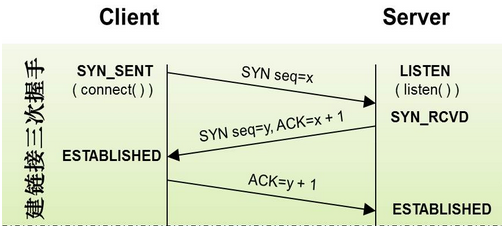
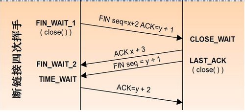

= 计算机与网络
:doctype: book
:toc: left
:toc-title: 目录
:toclevels: 4
:title-separator: -
:sectnums:
:allow-uri-read: ''
:include-path:

== TCP/UDP

=== Knowledge Point

==== 三次握手

* 第一次握手：主机 A 发送位码为 syn ＝ 1,随机产生 seq number=x 的数据包到服务器，客户端进入 SYN_SEND 状态，等待服务器的确认；主机 B 由 SYN=1 知道，A 要求建立联机；
* 第二次握手：主机 B 收到请求后要确认联机信息，向 A 发送 ack number(主机 A 的 seq+1),syn=1,ack=1,随机产生 seq=y 的包,此时服务器进入 SYN_RECV 状态;
* 第三次握手：主机 A 收到后检查 ack number 是否正确，即第一次发送的 seq number+1,以及位码 ack 是否为 1，若正确，主机 A 会再发送 ack number(主机 B 的 seq+1),ack=1，主机 B 收到后确认 seq 值与 ack=1 则连接建立成功。客户端和服务器端都进入 ESTABLISHED 状 态，完成 TCP 三次握手

[source,text]
----
6种TCP位码标识：
    SYN(synchronous建立联机)
    ACK(acknowledgement 确认)
    PSH(push传送)
    FIN(finish结束)
    RST(reset重置)
    URG(urgent紧急)
----

说明：`+Sequence number(顺序号码) Acknowledge number(确认号码)+`

==== 四次挥手

* 第一次挥手：主机 1（可以使客户端，也可以是服务器端），设置 Sequence Number 和 Acknowledgment Number，向主机 2 发送一个 FIN 报文段；此时，主机 1 进入 FIN_WAIT_1 状态；这表示主机 1 没有数据要发送给主机 2 了；
* 第二次挥手：主机 2 收到了主机 1 发送的 FIN 报文段，向主机 1 回一个 ACK 报文段，Acknowledgment Number 为 Sequence Number 加 1；主机 1 进入 FIN_WAIT_2 状态；主机 2 告诉主机 1，我也没有数据要发送了，可以进行关闭连接了；
* 第三次挥手：主机 2 向主机 1 发送 FIN 报文段，请求关闭连接，同时主机 2 进入 CLOSE_WAIT 状态；
* 第四次挥手：主机 1 收到主机 2 发送的 FIN 报文段，向主机 2 发送 ACK 报文段，然后主机 1 进入 TIME_WAIT 状态；主机 2 收到主机 1 的 ACK 报文段以后，就关闭连接；此时，主机 1 等待 2MSL 后依然没有收到回复，则证明 Server 端已正常关闭，那好，主机 1 也可以关闭连接了

=== Question and Answer

==== TCP 和 UDP 区别

* TCP 面向连接；UDP 面向无连接
* TCP 保证数据正确性；UDP 可能丢包
* TCP 传输速度慢；UDP 速度快
* 每一条 TCP 连接只能是点到点的；UDP 支持一对一，一对多，多对一和多对多的交互通信
* TCP 对系统资源要求较多，UDP 对系统资源要求较少。

[source,text]
----
1.为什么TIME_WAIT状态需要经过2MSL(最大报文段生存时间)才能返回到CLOSE状态？

虽然按道理，四个报文都发送完毕，我们可以直接进入CLOSE状态了，但是我们必须假象网络是不可靠的，有可以最后一个ACK丢失。所以TIME_WAIT状态就是用来重发可能丢失的ACK报文。

2.client发送完最后一个ack之后，进入time_wait状态，但是他怎么知道server有没有收到这个ack呢？莫非sever也要等待一段时间，如果收到了这个ack就close，如果没有收到就再发一个fin给client？这么说server最后也有一个time_wait哦？求解答！

因为网络原因，主动关闭的一方发送的这个ACK包很可能延迟，从而触发被动连接一方重传FIN包。极端情况下，这一去一回，就是两倍的MSL时长。如果主动关闭的一方跳过TIME_WAIT直接进入CLOSED，或者在TIME_WAIT停留的时长不足两倍的MSL，那么当被动

关闭的一方早先发出的延迟包到达后，就可能出现类似下面的问题：1.旧的TCP连接已经不存在了，系统此时只能返回RST包2.新的TCP连接被建立起来了，延迟包可能干扰新的连接，这就是为什么time_wait需要等待2MSL时长的原因。

----

== HTTP

=== Knowledge Point

==== 简介

HTTP 是无状态的，它的底层协议是由状态的 TCP，但是 HTTP 的一次完整协议动作，里面是使用有状态的 TCP 协议来完成的。而每次协议动作之间没有任何关系。

==== Request Method

`+HTTP1.0 定义了三种请求方法： GET, POST 和 HEAD 方法。+`

`+HTTP1.1 新增了五种请求方法：OPTIONS, PUT, DELETE, TRACE 和 CONNECT 方法。+`

.8中标准HTTP Request Method
[width="100%",cols="^10%,^20%,<70%",options="header",]
|===
|序号 |方法 |描述
|1 |GET |请求指定的页面信息，并返回实体主体。
|2 |HEAD |类似于 get请求，只不过返回的响应中没有具体的内容，用于获取报头
|3 |POST|向指定资源提交数据进行处理请求（例如提交表单或者上传文件）。数据被包含在请求体中。POST请求可能会导致新的资源的建立和/或已有资源的修改。
|4 |PUT |从客户端向服务器传送的数据取代指定的文档的内容。
|5 |DELETE |请求服务器删除指定的页面。
|6 |CONNECT |HTTP/1.1 协议中预留给能够将连接改为管道方式的代理服务器。
|7 |OPTIONS |允许客户端查看服务器的性能。
|8 |TRACE |回显服务器收到的请求，主要用于测试或诊断。
|===

==== HTTP 状态码

[source,text]
----
1xx：指示信息——表示请求已经接受，继续处理
2xx：成功——表示请求已经被成功接收、理解、接受。
3xx：重定向——要完成请求必须进行更进一步的操作
4xx：客户端错误——请求有语法错误或请求无法实现
5xx：服务器端错误——服务器未能实现合法的请求。
常见状态代码、状态描述、说明：
200 OK //客户端请求成功
400 Bad Request //客户端请求有语法错误，不能被服务器所理解
401 Unauthorized //请求未经授权，这个状态代码必须和 WWW-Authenticate 报头域一起使用
403 Forbidden //服务器收到请求，但是拒绝提供服务
404 Not Found //请求资源不存在，eg：输入了错误的 URL
500 Internal Server Error //服务器发生不可预期的错误
503 Server Unavailable //服务器当前不能处理客户端的请求，一段时间后可能恢复正常
----

==== HTTP 缓存

==== 拓展

.HTTP Request Method 有 15 种
[width="100%",cols="^10%,^20%,<70%",options="header",]
|===
| 序号 | 方法 | 描述
|9|PATCH|实体中包含一个表，表中说明与该 URI 所表示的原内容的区别。
|10|MOVE|请求服务器将指定的页面移至另一个网络地址。
|11|COPY|请求服务器将指定的页面拷贝至另一个网络地址。
|12|LINK|请求服务器建立链接关系。
|13|UNLINK|断开链接关系。
|14|WRAPPED|允许客户端发送经过封装的请求。
|15|Extension-mothed|在不改动协议的前提下，可增加另外的方法
|===

== Network

=== Question and Answer

==== HTTP 响应码 301 和 302 代表的是什么？有什么区别？

==== forward 和 redirect 的区别？

==== TCP 为什么要三次握手，两次不行吗？为什么？

==== 说一下 TCP 粘包是怎么产生的？

==== OSI 的七层模型都有哪些？

==== Get 和 Post 请求有哪些区别？

==== 如何实现跨域？

==== 说一下 JSONP 实现原理？
